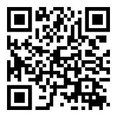

# 八字命理資料整理

## 心得筆記

從小，我最好的科目大概是數理化，對岸說的，學好數理化走遍天下都不怕！最弱的科目，大概是作文吧！我很難寫出什麼文情並茂的文章！所以我偏好把學會的東西，用不同於文章的形式表達出來！所以我就用程式來排命盤，檢視自己對八字了解的程度！但是因為程式的部分，進度頗慢，想說還是勉為其難的整理一些筆記跟大家交流，若有文意不順暢的地方，請大家多多包涵！

* [緣起](緣起.md)
* [關於命運](關於命運.md)
* [五行個性](五行個性.md)
* [二十四節氣](二十四節氣.md)
* [參考書籍](參考書籍.md)

## 免費八字命盤網址

網址：https://myfate.herokuapp.com/

## 工作項目

目前預計會完成以下的功能，打勾的部分表示已經做完 (但是會持續改善)！

- [X] [基本排盤](https://myfate.herokuapp.com/)
- [X] 五行律數計算
- [X] [五行個性判斷](五行個性.md)
- [X] [基本神煞計算](神煞.md)
- [X] [馬花庫計算](馬花庫.md)
- [ ] 納音五行
- [ ] 日主強弱判斷
- [ ] 定格局
- [ ] 取用神
- [ ] 大運吉凶判斷
- [ ] 流年吉凶判斷
- [ ] 流月、流日吉凶判斷

## 歡迎贊助我們

這個服務是我們利用閒暇時間，一點一滴慢慢開發出來的。在開發過程中，常常因為工作跟家庭的因素停頓下來。如果您覺得這個服務對您有幫助，歡迎贊助我們，讓我們可以更快、更專心的把這個服務做好！

[感謝大家的支持](致謝.md)！