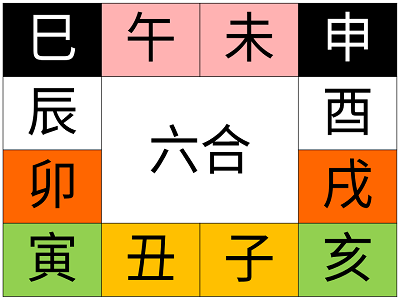

# 地支

地支相合有一定的成化條件 (這裡沒有列出來)，使用時須特別注意。

## 十二地支

|  |地支|陰陽|五行|生肖|
|--:|:-:|:-:|:-:|:-:|
| 1|子|陰|水|鼠|
| 2|丑|陰|土|牛|
| 3|寅|陽|木|虎|
| 4|卯|陰|木|兔|
| 5|辰|陽|土|龍|
| 6|巳|陽|火|蛇|
| 7|午|陰|火|馬|
| 8|未|陰|土|羊|
| 9|申|陽|金|猴|
|10|酉|陰|金|雞|
|11|戌|陽|土|狗|
|12|亥|陽|水|豬|

### 有趣的規律

將地支屬土的辰、戌、丑、未刪掉，剩下的八個地支會是陰陽交錯的順序。

|地支|子|~~丑~~|寅|卯|~~辰~~|巳|午|~~未~~|申|酉|~~戌~~|亥|
|:-:|:-:|:-:|:-:|:-:|:-:|:-:|:-:|:-:|:-:|:-:|:-:|:-:|
|陰陽|陰|~~陰~~|陽|陰|~~陽~~|陽|陰|~~陰~~|陽|陰|~~陽~~|陽|

|地支|子|寅|卯|巳|午|申|酉|亥|
|:-:|:-:|:-:|:-:|:-:|:-:|:-:|:-:|:-:|
|陰陽|陰|陽|陰|陽|陰|陽|陰|陽|陰|陽|

|地支|丑|辰|未|戌|
|:-:|:-:|:-:|:-:|:-:|
|陰陽|陰|陽|陰|陽|

## 地支藏干

|地支|子|丑|寅|卯|辰|巳|午|未|申|酉|戌|亥|
|:-:|:-:|:-:|:-:|:-:|:-:|:-:|:-:|:-:|:-:|:-:|:-:|:-:|
|本氣|癸|己|甲|乙|戊|丙|丁|乙|戊|辛|戊|壬|
|中氣|  |癸|丙|  |乙|戊|己|己|庚|  |辛|甲|
|餘氣|  |辛|戊|  |癸|庚|  |丁|壬|  |丁|  |

## 地支三會

亥子丑三會水局，寅卯辰三會木局，巳午未三會火局，申酉戌三會金局。

## 地支三合

申子辰三合水局、寅午戌三合火局、亥卯未三合木局、巳酉丑三合金局。

## 地支半三合

### 申子辰

* 申子(強)半三合水局。
* 子辰(中)半三合水局。
* 申辰(弱)半三合水局。

### 寅午戌

* 寅午(強)半三合火局。
* 午戌(中)半三合火局。
* 寅戌(弱)半三合火局。

### 亥卯未

* 亥卯(強)半三合木局。
* 卯未(中)半三合木局。
* 亥未(弱)半三合木局。

### 巳酉丑

* 巳酉(強)半三合金局。
* 酉丑(中)半三合金局。
* 巳丑(弱)半三合金局。

## 地支六合

子丑合土、寅亥合木、卯戌合火、辰酉合金、巳申合水、午未合火。

橫的是合，縱的是冲。

## 地支六冲

子午冲、丑未冲、寅申冲、卯酉冲、辰戌冲、巳亥冲。

## 地支六害

子未相害、丑午相害、寅巳相害、卯辰相害、申亥相害、酉戌相害。

## 地支四刑

### 恃勢之刑

未刑丑、丑刑戌、戌刑未。

仗勢欺人，導致不好結果。

### 無恩之刑

寅刑巳、巳刑申、申刑寅。

恩將仇報，導致不好結果。

### 無禮之刑

子刑卯、卯刑子。

禮儀上有過錯，導致不好的結果。

### 自刑

辰刑辰、午刑午、酉刑酉、亥刑亥。

自己跟自己過不去！

